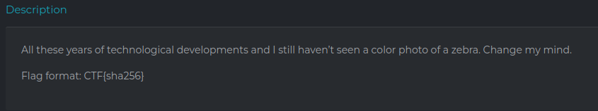

## zebra_lib


The challenge's description :



Netcatting the given address and port we discover an app:


We get some sort of random string everytime and we have limited time to input a " work proof " as the screenshot indicates.

If we spend more than 10 seconds the session is aborted.


``` eJwrzy_Kji8oys9Ps000Lc7MSM1IS6syTc1ITTVJTjVLSTFJM6zKMEwysSzPAABseg_F ```

Looking at the string, i was unable to identify it's nature so i tried hashid


After playing with it for a little while, i decoded it from base64 and to Hex using Cyberchef :


zebra-lib ? maybe it's a hint to z-lib ? 
``` 78 9c ``` is for sure the z-lib header.


Passing our proof of work to the server we get another one :


Usually, it takes more than one or two iterations to solve a proof of work so it won't do us any good doing that manually.
=======> Python

```
from pwn import *
import zlib
from base64 import *

conn = remote('34.159.7.96',30441 )
i = 0
while True:
	i+=1
	print(conn.recvline())
	a = conn.recvline()
	print(a)
	hashy = a.decode("utf-8").replace("\r\n","") 
	print(hashy)
	print(hashy)
	decoded = urlsafe_b64decode(hashy)
	proof = zlib.decompress(decoded)
	print(proof)
	conn.sendline(proof)
	print(conn.recvline())
conn.close()

```

It took us 500 iterations to get the flag weeeeeeeeeee


Made By Fckroun <3
