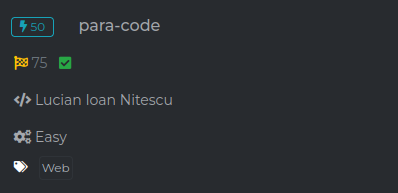
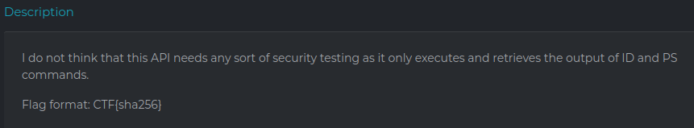
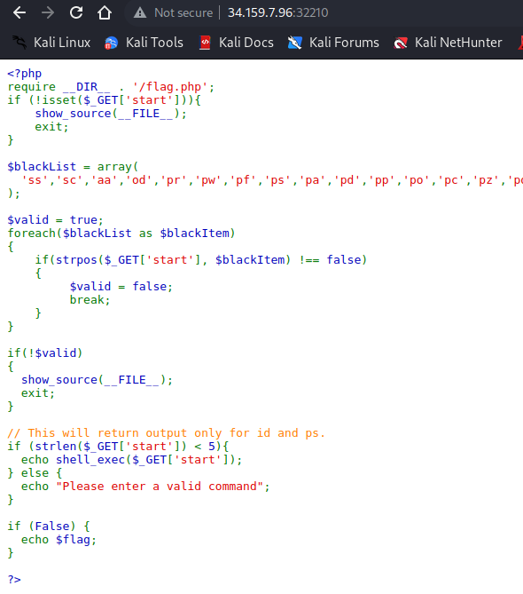
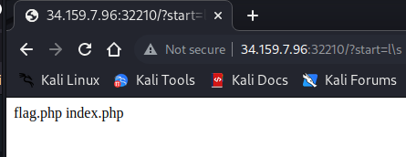
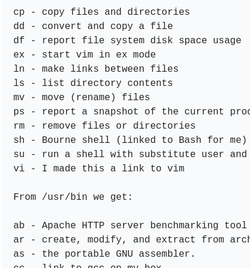
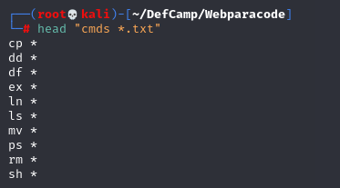
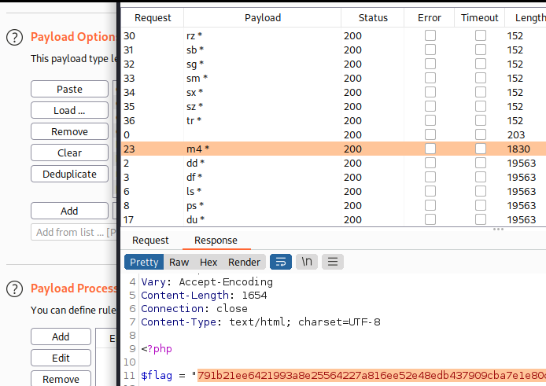

## para_code

The challenge's description :

I immediately thought about RCE when i saw ps and id.

Visiting the provided URL we get a php app showing it's juicy source code, we notice :

* ./flag.php which may include our precious flag
* $_GET['start'] which is passed to shell_exec if it's length < 5
* $blackList which as its name indicates a list containing some banned linux cmds

ls is banned but i managed to bypass the filter including a blackslash into the blacklisted command (the blacklist doesn't contain " l\s " , the shell will intrepret it as " ls ")

that didn't help but it's an RCE for sure.

After playing with the app i came up with a conclusion :
We can only use 2 letter commands cuz :
* We should use " < " or a space and " * " to pass all files in the current directory as input
* We should ALSO not break the 4 letter rule (< 5)

I finally decided to bruteforce the " start "  parameters, so i fired up burp and looked for 2 letter linux commands

I cleaned that up, concatenated a space and " * " 

Loaded the wordlist to burp intruder and started the attack ...

After few seconds i noticed a response with a different size and yep that was fast :

Made by Fckroun with <3
