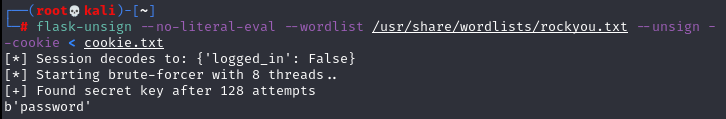

## web_intro


The challenge's description :


The website responded with Access denied.


We try this with Burp:


We can notice an indication that it's a python server and a cute cookie in the response's headers :

```eyJsb2dnZWRfaW4iOmZhbHNlfQ.YglxiQ.sMMeYTTrGhfxV4A0hLMxWrG1WS0 ```

So probably this is a flask cookie, let's try to decode it using:

```flask-unsign --decode --cookie 'eyJsb2dnZWRfaW4iOmZhbHNlfQ.YglxiQ.sMMeYTTrGhfxV4A0hLMxWrG1WS0'```


Changing the "logged_in" parameter to True is possible but we should sign the cookie with a secret we don't know yet.

I tried first to bruteforce it with the rockyou dictionary using the same tool and luckily, we got the secret:



We are now two steps away from getting access to the web app.
First we decode the cookie, change the value of "logged_in" to True and sign it again with our cracked secret.


Passing our innocent cookie to the web app we get the flag :


Made By Fckroun with <3